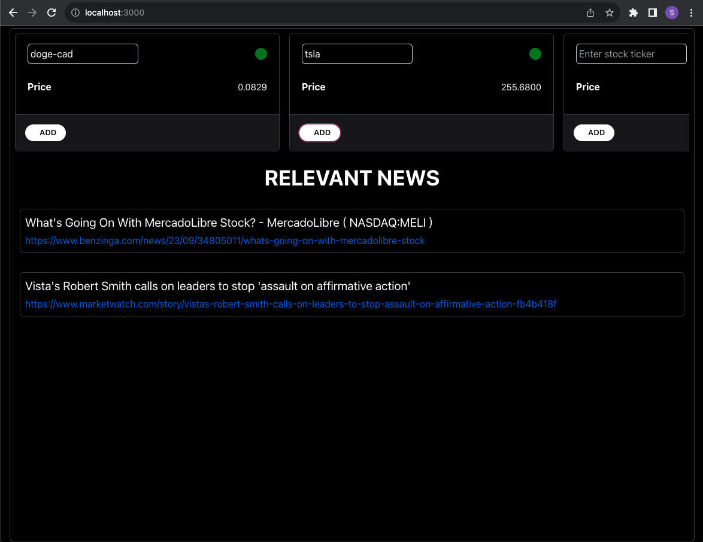

# Stock watch

This app leverages powerful toolsExpress.js, WebSockets, and Protobuf.js to provide swift and accurate access to live stock prices and news, outpacing even Yahoo Finance's display speed.

## Features

- Express.js web application framework.
- WebSocket for real-time bi-directional communication.
- Relevant news sentiment analysis using Alphavantage's API.
- Live stock data fetched from Yahoo Finance using WebSockets and Protobuf.js for efficient data serialization.
- CORS middleware to handle cross-origin requests.

## Demo

[]
